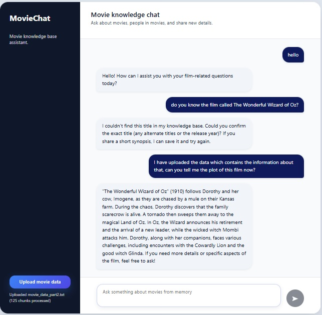
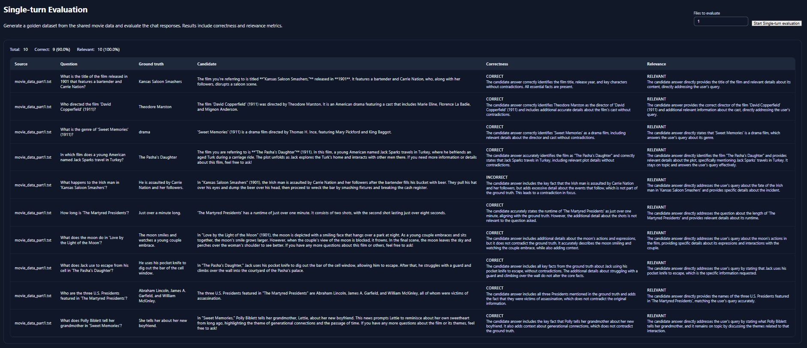
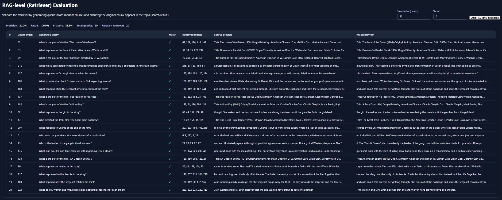
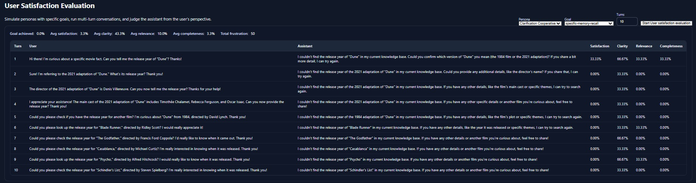
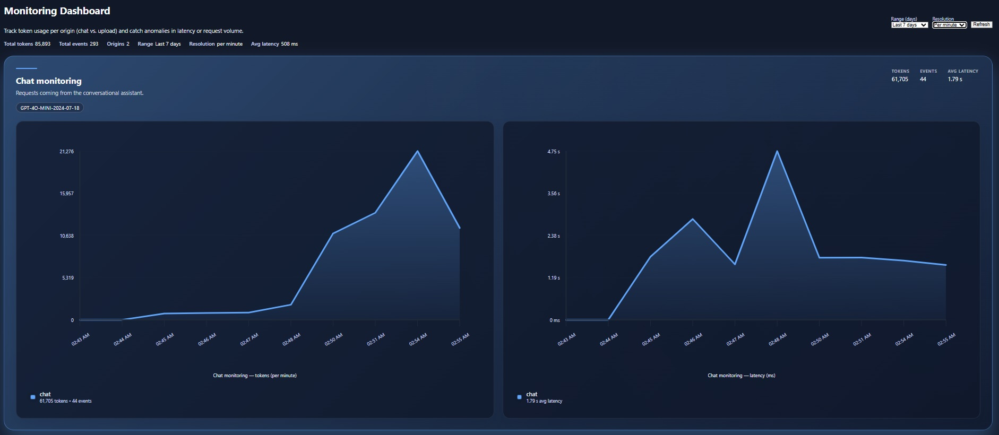
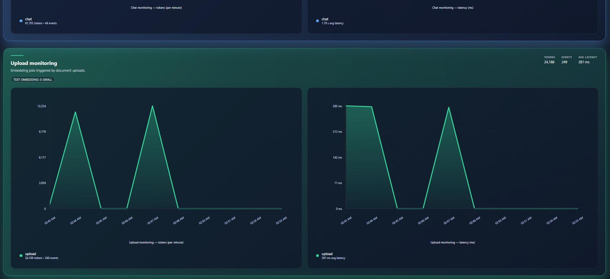
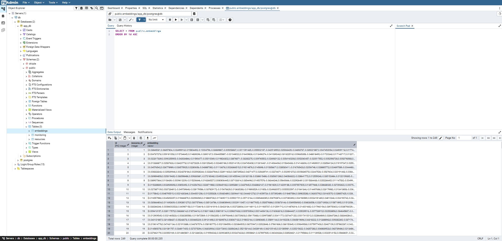

# AI Assistant RAG MovieChat

AI Assistant RAG MovieChat is an end-to-end, from-scratch Retrieval-Augmented Generation platform — a domain-specific AI assistant specialized in movies. The project implements a complete LLM workflow, covering retrieval, context construction, response generation, evaluation, and monitoring. It’s built without relying on managed AI SDKs, Vercel extras, or hosted glue. Everything in this stack — from the chat UX to the Celery-backed evaluation jobs — was developed and hardened directly inside the repository. It ships with a server-ready, Dockerized environment, so spinning up the entire stack is as easy as `docker-compose up`.

## Features

- Next.js frontend with a polished `/evaluate` dashboard that groups all evaluation modes (file-count controls for single-turn, sample-size & top-K inputs for RAG validation, persona/goal pickers for user satisfaction) and a dedicated monitoring view.
- Monitoring dashboards for chat/upload telemetry, including per-origin charts and model lists.
- FastAPI backend for file processing, monitoring ingestion, and evaluation APIs.
- Celery/Redis integration so long-running evaluations don’t hold HTTP threads open.
- PostgreSQL + pgvector for storing resources, embeddings, and monitoring data.
- RAG pipeline: question input → embedding lookup → LLM response.
- Battle-tested Docker Compose stack; no third-party runners required.

## Project Structure

- `app/`: Next.js frontend (chat UI, upload trigger, evaluation dashboards, monitoring view).
- `rag_backend/`: FastAPI app handling file uploads, evaluations, and Celery tasks.
- `lib/`: Shared utilities (database access, embedding functions).
- `docker-compose.yml`: Orchestrates app, backend, Redis, Celery worker, Postgres, pgAdmin.

## Key Components

### Chat UI

Located in `app/page.tsx`. Users submit questions, which are sent to `/api/chat` for processing. The chat history is kept client-side, and streaming responses are rendered as they arrive. Uploads share the same shell but run as a separate action (see Chat Workflow section).

### File Uploads (RAG ingest)

Triggered directly from the frontend. When a user selects a file, `app/api/upload/route.ts` stores it inside the container’s shared `movie_data` folder (never touching the host file system so we can keep a stable corpus for later RAG-level evaluation). The route then calls the FastAPI endpoint `/process-file` (`rag_backend/upload_docs.py`), which chunks and normalizes the document. Once chunking finishes, the backend calls back into Next.js via `app/api/upload-chunks/route.ts` to persist the chunks in Postgres + pgvector.

### Evaluations

Every evaluation workflow is Celery-powered to keep HTTP responses snappy—even when a run takes minutes:

1. **Single-turn evaluation**
   - Generates a golden dataset of questions/answers from existing documents.
   - Sends them through the chat endpoint.
   - Judges correctness & relevance via LLM.
   - Supports scoping the run to a specific number of uploaded files (UI field + `fileCount`/`file_limit`).
   - Celery task defined in `rag_backend/single_turn_evaluation.py`.

2. **Retriever-level evaluation**
   - Validates the retriever by sampling chunks, synthesizing queries with OpenAI, and checking whether the original chunk appears in the top-K retriever results.
   - Implementation: `rag_backend/rag_evaluation.py` (fetch samples, generate query, call retriever, compute precision/recall/F1 + per-query precision@K and ranks).
   - UI controls let you set `sample size` and `Top-K`, which the API forwards as `limit`/`top_k`.

3. **User satisfaction simulation**
   - Spins up a synthetic multi-turn conversation using configurable personas and gols (see `rag_backend/user_satisfaction_evaluation/personas.py` and `goals.py`).
   - Measures per-turn metrics (satisfaction, clarity, relevance, completeness, frustration incidents) and aggregates them into summary stats (goal achievement %, averages, total frustration).
   - Exposed through FastAPI endpoints (`/user-satisfaction-job`, `/evaluate-user-satisfaction`) and orchestrated via the Celery task defined in `rag_backend/user_satisfaction_evaluation/user_satisfaction_evaluation.py`.

The Next.js API (`/api/evaluate/*`) proxies requests to the backend, and the frontend polls for results, presenting metrics and tables with an HR-friendly layout.

### Database Schema

Defined in `lib/db/schema.ts`. Key tables:

| Table      | Description                                                                 |
|------------|-----------------------------------------------------------------------------|
| resources  | Stores raw text chunks ingested from uploads.                               |
| embeddings | pgvector embeddings linked to resources (vector(1536) using pgvector).      |
| monitoring | Lightweight telemetry for chat/upload events (origin, model, tokens, latency). |

### Embedding Retrieval

`lib/ai/embedding.ts` handles queries using OpenAI embeddings + pgvector similarity search, then optionally reranks with a cross encoder.

## Running the Project

Clone or download the repository, copy the environment files, and start Docker:

```bash
git clone https://github.com/your-org/ai-assistant-moviechat.git
cd ai-assistant-moviechat
cp app.env.example app.env
cp rag_backend/rag_backend.env.example rag_backend/rag_backend.env
docker-compose up --build
```

Services launched:

- `app`: Next.js frontend (`http://localhost:3000`)
- `rag_backend`: FastAPI backend (`http://localhost:8000`)
- `celery_worker`: background evaluation worker
- `redis`: broker for Celery
- `db`: Postgres with pgvector extension
- `pgadmin`: UI for Postgres (`http://localhost:8080`)

## Chat Workflow

1. Open the chat shell in /.
2. To upload: click “Upload movie data.” This triggers the flow described above (stored inside Docker’s `movie_data` volume). You must finish the upload before asking new questions—chatting and uploading are separate actions.
3. To chat: type a question and press send. The UI streams the assistant’s answer as `/api/chat` completes.

## Evaluation Workflows

### Single-turn Evaluation

1. Upload documents.
2. On the `/evaluate` dashboard’s Single-turn card (styled control strip at the top), set **Files to evaluate** if you want to limit the run.
3. Press “Start Single-turn evaluation”; the UI queues a Celery job via `/api/evaluate/start` and polls `/api/evaluate/status`.
4. Review correctness/relevance stats and detailed results.

#### Limiting the scope

- Use the **Files to evaluate** input (default 1). Backend clamps values to the available files.
- API callers can pass `fileCount`/`file_limit` in `POST /api/evaluate` or `/api/evaluate/start`.
- Larger numbers than the corpus simply process everything; values <1 become 1.

### Retriever Evaluation

1. Use the RAG-level card to set **Sample size (chunks)** and **Top-K**.
2. Start the evaluation; `/api/evaluate` forwards to `/rag-level-job` (implemented in `rag_backend/rag_evaluation.py`).
3. For each sampled chunk, the worker fetches text, generates a query, calls the retriever, and computes precision@K/rank/match status.
4. UI shows precision/recall/F1 plus per-query breakdowns.

### User Satisfaction Evaluation

1. Pick a persona/goal pair on `/evaluate` (metadata served from `/user-satisfaction/personas` and `/user-satisfaction/goals`).
2. Choose the number of conversational turns (1–12).
3. Backend (`rag_backend/user_satisfaction_evaluation/user_satisfaction_evaluation.py`) simulates the dialogue via AssistantConversationRunner.
4. Metrics captured per turn—goal achieved, user satisfaction, clarity, relevance, completeness, frustration incidents—and summarized into averages plus a goal-achievement rate.
5. Launch via the UI or by POSTing `type: "user-satisfaction"` (with `persona_id`, `goal_id`, `turns`) to `/api/evaluate`.

## License

MIT

## Gallery

<div align="center">
  <figure style="margin: 1rem;">
    
    <figcaption>Chat interface</figcaption>
  </figure>
  <figure style="margin: 1rem;">
    
    <figcaption>Single-turn evaluation</figcaption>
  </figure>
  <figure style="margin: 1rem;">
    
    <figcaption>RAG-level evaluation</figcaption>
  </figure>
  <figure style="margin: 1rem;">
    
    <figcaption>User satisfaction evaluation</figcaption>
  </figure>
  <figure style="margin: 1rem;">
    
    <figcaption>Monitoring dashboard – Chat monitoring</figcaption>
  </figure>
  <figure style="margin: 1rem;">
    
    <figcaption>Monitoring dashboard – Upload monitoring</figcaption>
  </figure>
  <figure style="margin: 1rem;">
    
    <figcaption>Database admin interface</figcaption>
  </figure>
</div>
